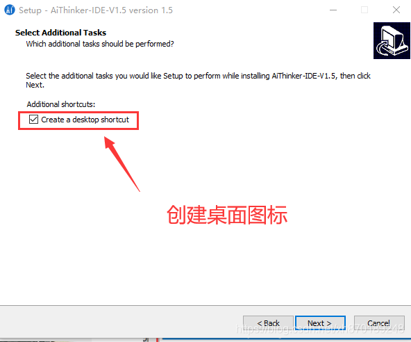

# 【安信可IDE 1.5模板专题1】安信可windows一体化环境IDE V1.5 版本降临，体积更小，兼容新旧版本SDK编译 #

本系列博客学习由官方人员 安信可科技 潜心所力所写；

- 1、【设备端】安信可windows一体化环境IDE V1.5 版本降临，体积更小，兼容新旧版本SDK编译；
- 2、【设备端】安信可windows一体化环境IDE V1.5 二次开发直连阿里云飞燕平台，天猫精灵语音控制；

文章目录


> 一、前言
> 
> 二、下载安装
> 
> 三、编译带操作系统的 ESP8266 RTOS 3.0 工程；
> 
> 3.1 导进IDE
> 
> 3.3 配置环境步骤：
> 
> 3.4 编译步骤：
> 
> 3.5 下载步骤：
> 
> 四、编译 NONOS SDK V3.0/2.1.x/2.2.x版本
> 
> 导入步骤：
> 
> 编译步骤：
> 
> 烧录
> 
> 五、编译 NONOS SDK V2.0 版本或以下
> 
> 六、AiClouds3.0 地址
> 
> 感谢：
> 
> 地址：
> 


## 一、前言 ##

目前的安信可windows一体化环境IDE 1.0版本已经满足不了我们的需求了，原因在于所用的 gui 环境是比较久的，为了更一步满足普通开发者的需求，我封装推出了新版本的IDE，即将支持：

- 支持 ESP8266 的 NONOS 2.0 和 3.0 版本二次开发； 支持 ESP32 的 IDF 框架开发，支持 ESP-cam;
- 开发板二次开发； 提供支持 天猫精灵IoT平台/阿里物联网生活平台/阿里飞燕/百度天工的模板SDK接入；
- 提供多种多样的demo项目，使开发者快速开发使用自己的业务；
- SDK资源开发包使用 Git 管理，用户可自行更新；

## 二、下载安装 ##

最近的百度网pan的下载速度一度再下降，为了换个方式存储IDE，所以，我们放在了群文件里面了。不过安装前，务必注意：

第一点：因为新版的IDE安装过程中会给电脑配置环境变量，所以，安装了0.5或1.0版本的朋友，请主动自行在电脑环境变量删除有关的PATH变量值，包含 AiThinkerIDE_V1.0 关键字的，比如：

	Ai-Thinker\AiThinkerIDE_V1.0\msys32\mingw32\bin

第二点：如果是采用我司的0.5或1.0版本来开发的项目，需自行删除工程根目录的 .setting 这个文件夹，因为他里面包含一些就工程的配置。

第三点：环境依赖的是 python2.8 环境，而且 IDE （gui 环境）自带了 python2.8的环境的，如果你电脑有 py3 的环境，建议卸载或共存处理；

下载安装包之后，一路 Next 就可以了；我们再次检查是否会自动添加环境变量：

```
IDE安装路径\msys32\mingw32\bin
IDE安装路径\msys32\usr\bin
IDE安装路径\msys32\opt\esp32\xtensa-esp32-elf-5.0\bin
IDE安装路径\msys32\opt\esp8266\v5.2.0_for_3.0\bin
```

我们可以在电脑的环境变量看到这个确实有了：




## 三、编译带操作系统的 ESP8266 RTOS 3.0 工程； ##

事前确定电脑环境变量是否成功PATH配置了如下变量(根据自己电脑路径有所差异)：


3.1 导进IDE

我们提供的这个SDK是基于官方的RTOS master分支上有所修改，并增加了开发模板，详情见 README 文档；

因为SDK和开发环境是分开的，所以下载的地方随心所欲；

但是强调：下载路径务必不能带空格或中文字符！

下载时候务必要把子模块拉取下来，不能直接点击 download 下载，否则- 得到的是一个不完整的开发包！！
- 所以，请自行百度教程安装 git 版本管理的软件；

```
	git clone --recursive https://gitee.com/xuhongv/AiThinkerProjectForESP.git
```

- 点击C/C++分支，选择 Existing Code as MakeFile Project 工程;
- 复制刚刚的下载的文件夹路径，import --> Cross Gcc , 并且去掉对应的 C++ 勾勾；

主要步骤如下动图操作所示（忽略文件夹名字）：


3.3 配置环境步骤：

- 项目属性设置，鼠标选中项目名称右键点击，在右侧菜单中选择Properties
- 在 Properties --> C/C++ Build --> Build directory 选择编译的工程路径，比如 examples\get-started\project_template 工程。
- 添加IDF环境变量在 Properties --> C/C++ Build --> Environment 点击Add ，路径为刚刚的下载的文件夹路径，变量名字为 IDF_PATH;
- 然后点击 OK 保存退出！
- 控制台输出只保留 Console ，其他一律关闭！

主要步骤如下动图操作所示（忽略文件夹名字）：


3.4 编译步骤：

与其他版本不一样， rtos3.0或以上支持面板设置参数，即通过 make menuconfig 设置，同样地，我们可以利用快捷键去快速设置；

- 构建menuconfig菜单，选中项目名称，在右键菜单中选择 Make Targets --> Create；或者快捷键 Alt + F9 ;
- 在弹出的对话框中取消勾选Same as the target name 与 User builder settings 这2个选项，并且
- 在Build command 中输入mintty.exe -e make menuconfig。

如下动图操作所示（忽略文件夹名字）：


然后，就可以编译工程了，点击 Build Project，编译过程需要的时间5分钟以上，取决电脑配置，耐心等待，当出现以下信息，说明编译成功！


3.5 下载步骤：

配置快捷键进行下载，其命令是 make flash ，如果指定端口进行烧录下载固件比如 com12 的话，可以这样写： make flash ESPPORT=COM12 ；

如下动图操作所示（忽略文件夹名字）：


烧录完毕之后，日志打印会如下所示（忽略文件夹名字）：


## 四、编译 NONOS SDK V3.0/2.1.x/2.2.x版本 ##

事前确定电脑环境变量是否成功PATH配置了如下变量(根据自己电脑路径有所差异)：


因为很多小伙伴在玩无操作系统开发（简称 NONOS SDK），而此 SDK 网上有2大版本流行，分别是 3.0 为一个划分界限，而我们的IDE也支持这样的开发兼容，下面先给大家讲解如何编译NONOS 3.0 SDK的！经测试，从仓库下载的下载的 2.2.x 和 2.1.x 分支，都可以用这个环境编译！

如果你的工程较久的话，直接参考下一节的配置。

首先克隆代码，这里我依然选择为用 git 拉取：

	git clone https://gitee.com/xuhongv/ESP8266_NONOS_SDK

导入步骤：

- 手动删除根目录下的driver_lib和 third_party这2个文件夹；
- 然后点击C/C++分支，选择 Existing Code as MakeFile Project 工程;
- 复制刚刚下载文件的 ESP8266_NONOS_SDK的路径，import --> Cross Gcc , 并且去掉对应的 C++ 勾勾；如下动图所示：


编译步骤：

- 项目属性设置，鼠标选中项目名称右键点击，在右侧菜单中选择Properties ；
- 选择Properties --> C/C++ Build --> Build command 中添加编译规则，当前硬件是 32Mbit的模块，所以这样填：( make COMPILE=gcc BOOT=new APP=1 SPI_SPEED=40 SPI_MODE=DIO SPI_SIZE_MAP=6 )；
- 在Properties --> C/C++ Build --> Build directory 选择编译的工程路径，比如根目录下的 IoT_Demo工程。
- 然后，就可以 清理工程 clean Project 和编译工程 build Project 了；
- 控制台输出只保留 Console ，其他一律关闭！


编译成功之后，从控制台看到：

```
!!!
No boot needed.
Generate eagle.flash.bin and eagle.irom0text.bin successully in folder bin.
eagle.flash.bin-------->0x00000
eagle.irom0text.bin---->0x10000
!!!
```

烧录

从官方下载烧录工具，插上安信可出的 nodemcu 模块，选择各个 bin 文件，如下的配置，先 ERASE ，再 START 即可：


默认的打印波特率 74880 ，那么我们的电脑串口软件要支持 74880，下面以 SmarTTY 软件为例，如下打印，表示运行成功！


五、编译 NONOS SDK V2.0 版本或以下

上面已经讲解了如何编译 3.0/2.2x/2.1.x版本或以上的，这里就讲解如何编译2.0或更旧版本之间的代码。具体的工程也不再维护了，大家手上的应该是较久的一些版本把，比如技新课堂的教程工程等；

我们先下载一个压缩包 plugin_cywin和较久的工具链 v4.8.2_for_2.0 解压到安装目录，导入前，务必更改环境变量，在电脑的环境变量操作如下：

在PATH添加以下的环境变量：

	D:\Ai-Thinker_V1.5\plugin_cywin\bin
	D:\Ai-Thinker_V1.5\msys32\opt\esp8266\v4.8.2_for_2.0\bin

在PATH删除以下的环境变量：

	D:\Ai-Thinker_V1.5\msys32\opt\esp8266\v5.2.0_for_3.0\xtensa-lx106-elf\bin
	D:\Ai-Thinker_V1.5\msys32\mingw32\bin
	D:\Ai-Thinker_V1.5\msys32\opt\esp32\xtensa-esp32-elf-5.0\bin

之后，导入步骤和编译步骤和之前的和导入3.0版本的一样！

六、AiClouds3.0 地址

安信可IDE 1.5属于 AiClouds 3.0 架构的一款应用；

感谢：

- PHP微信对接：https://github.com/zoujingli/WeChatDeveloper
- PHP Oauth2.0：https://github.com/bshaffer/oauth2-server-php
- PHP 框架：http://www.thinkphp.cn
- 乐鑫物联网操作系统：https://github.com/espressif/esp-idf

地址：

- xClouds服务器端开源地址：https://github.com/xuhongv/xClouds-php
- xClouds设备端开源地址：https://github.com/xuhongv/xClouds-device
- 项目遵循协议： Apache License 2.0
- 
1、额外说明，架构中提到的对公司或组织的观点，如有争议，请联系我；

2、架构中涉及到的技术点，我会一一公布出来以表感谢；

3、同时，也欢迎大家支持我，或一起壮大这个框架，奉献你代码项目；

————————————————

版权声明：本文为CSDN博主「安信可科技」的原创文章，遵循CC 4.0 BY-SA版权协议，转载请附上原文出处链接及本声明。

原文链接：https://blog.csdn.net/Boantong_/article/details/106229281